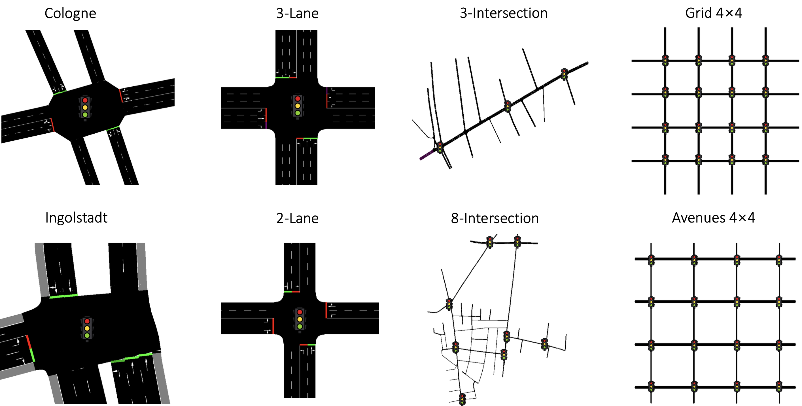

# Traffic Signal Control Using Lightweight Transformers: An Offline-to-Online RL Approach

***Fixed some bugs in the old version.***

Source code implementing DTLight, the method in Traffic Signal Control Using Lightweight Transformers: An Offline-to-Online RL Approach.
The implementation is based on the open-source code of [RESCO](https://github.com/Pi-Star-Lab/RESCO) and [ODT](https://github.com/facebookresearch/online-dt).

The benchmark uses the Simulation for Urban Mobility (SUMO), which must be installed separately. The conda environment can be installed by using

 `conda env create -f conda_env.yml`.

Eight scenarios are used to test DTLight. We create two synthetic single-intersection control scenarios, i.e., a signalized intersection with four three-lane approaches named _3-Lane_ and an intersection with four two-lane approaches named _2-Lane_. We adopt the other six scenarios from the RESCO benchmark: Cologne1, Ingolstadt1, Cologne3, Cologne8, Grid 4 × 4, and Arterial 4 × 4.



**DTRL**, i.e., Datasets for Traffic Signal Control with Offline Reinforcement Learning, includes 16 offline datasets. These datasets are generated from the eight scenarios by two different behavior policies: a conventional TSC method EMP (Max Pressure with additional $\epsilon$-greedy exploration) and an RL-based TSC method IDQN.
Due to the file upload size limit, we are unable to upload the offline datasets for Grid 4 × 4 and Arterial 4 × 4, but we can generate them using `offline_data_generator.py`.

Please go through the following two steps to generate offline data and run experiments for DTLight.

1. run offline_data_generator.py and generate offline data. An example command to generate an offline dataset on the 2-Lane scenario with IDQN as behavior policy:

   `python src/offline_data_generator.py --agent IDQN --map 2lane`

2. run main_offline.py to execute DTLight. An example command:

    `python main_offline.py`

You can also directly unzip `DTRL.zip` to get the offline datasets and then use the above command to execute DTLight.

## citation
If you find this repo beneficial for your research, please kindly consider citing our work:

```
@article{huang2023traffic,
  title={Traffic Signal Control Using Lightweight Transformers: An Offline-to-Online RL Approach},
  author={Huang, Xingshuai and Wu, Di and Boulet, Benoit},
  journal={arXiv preprint arXiv:2312.07795
        },
  year={2023}
}
```
